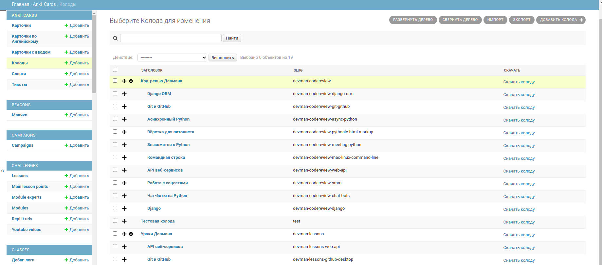
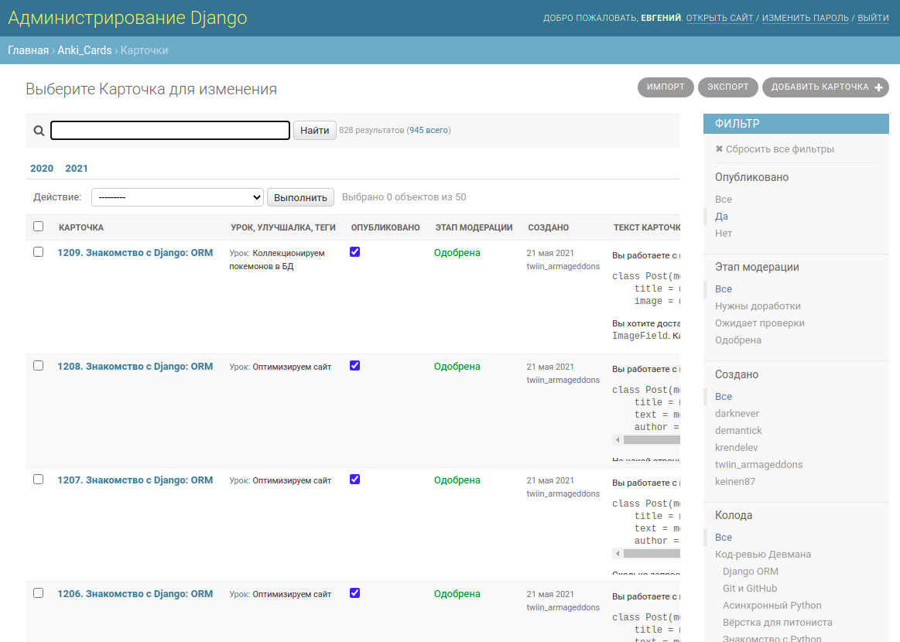
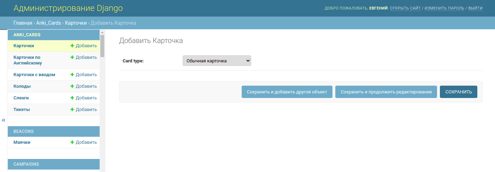
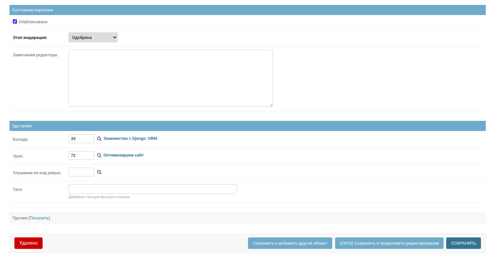

# Анки-карточки с сайта Девмана dvmn.org

В репозитории лежит код, написанный для сайта Девмана [dvmn.org](https://dvmn.org). Это одно единственное django-приложение `anki_cards`. Оно вырвано из большой кодовой базы, некоторые импорты поломаны, поэтому запустить  код не выйдет, но чтению это не мешает.

Приложение `anki_cards` нужно для создания карточек Anki по урокам Девмана и код-ревью. Карточки создаются через админку Django, а затем скачиваются в виде apkg-файла.

## APKG-файл

Файл с расширением `.apkg` используется для экспорта и импорта карточек в приложение AnkiDroid на телефоне или десктопный аналог.

APKG-файл представляется собой обычный zip-архив, внутри которого обязательно лежит файл с базой данных SQLite. Внутри БД находятся шаблоны карточек, колоды, теги и сами карточки.

И шаблоны и отдельные карточки могут содержать HTML-разметку с тегами, стилями, картинками и подключаемыми CSS-файлами. Приложение AnkiDroid работает подобно браузеру -- оно отображая пользователю HTML-разметку и скачивает из интернета всё, чего не хватает для отображения карточки.

Файл `.apkg` помимо базы данных может содержать картинки, аудио- и видео-файлы. Из anki-карточек на эти ресурсы проставляются ссылки.

## Рендер markdown-разметки

На сайте Девмана карточки Anki создаются с помощью markdown-разметки, а в HTML превращаются с помощью скрипта Node.js `render_anki_md.js`. Этот скрипт и его исходники исключены из репозитория, чтобы не переусложнять задачу. Вам важно знать только, что скрипт считывает markdown-разметку через STDIN и отвечает HTML-разметкой через STDOUT.

## Как выглядит админка

В приложении Anki сильно изменена стандартная админка. Сделано это ради удобства использования в таких сценариях:

- Фильтруем и ищем карточки в списке
- Редактируем карточку и сразу видим превью
- Публикуем карточку
- Группируем карточки по колодам

Чтобы легче себе было представить работу админки посмотрите сриншоты ниже.

### Колоды




### Список карточек




### Добавление карточки








## Вопросы по коду

Ниже перечислены те вопросы, на которые надо дать **внятный письменный ответ**. Оформите его в виде отдельного Gist с разметкой в markdown. Вот пример с фрагментом такого документа:

```markdown
> Зачем нужен метод `str.upper`?

Метод создаёт новую строку, в которой все символы переведены в верхний регистр. Например, `'заголовок'` --> `'ЗАГОЛОВОК'`

> Как изменить строку не создавая новую?

...
```

Список вопросов не отменяет задачи **прочитать всю кодовую базу**. На созвоне ментор будет спрашивать и то, чего нет в списке.

Ответы на вопросы можно искать коллективными усилиями, обсуждать в чате или на личных созвах. Но нельзя копировать чужие ответы. Формулировки должны быть строго свои собственные.

### A. Файл requirements.txt

A1. Зачем нужна каждая библиотека в `requirements.txt`?


### B. Файл anki_cards/models.py

B1. Для каждой модели в models.py приведите пример наполнения БД. Оформите это в виде JSON/YAML, например:

```yaml
Article:
    title: Как запустить Gunicorn
    author: [id пользователя]
    ...
...
```

B2. Что такое `MPTTModel` и зачем понадобился?

B3. Что такое `MPTTMeta`?

B4. Строка 40. Зачем понадобился unique_together? Кому и какую пользу он причиняет?

```python
unique_together = [
    ['name', 'parent']
]
```

B5. Как под капотом устроено поле `MarkupField`? Что лежит в базе данных? Как и когда происходит рендер markdown?

B6. Как модель `BaseCard` связана с `BasicCard` и `EnglishCard`? Сколько таблиц в БД создаётся и как они связаны между собой?

B7. Зачем нужна модель `BaseCard`?

B8. Почему модель `BaseCard` не сделали абстрактной? В чём польза от такого решения?

### C. Файл devman/markdown.py

C1. Строка 17 -- о каком `returncode` идёт речь? Что лежит в этом атрибуте?

C2. Что делает функция `render_markdown`?

C3. Зачем понадобилась функция `render_in_bulk`? В чём профит?


### D. Файл anki_cards/admin.py

D1. Что полезного делает `CustomTagListFilter`?

D2. Что полезного делает `BaseCardsResource`?

D3. Что полезного делают методы `BaseCardsResource.dehydrate_*`?

D4. В какой момент вызывается и что полезного делает метод `BaseCardsResource.import_field`?

D5. Что полезного делает метод `DeckAdminResource.import_field`?

D6. Зачем нужен `DraggableMPTTAdmin`?

D7. Зачем понадобилась функция `get_tags`?

D8. Зачем понадобилась форма `BaseCardAddForm`?

D9. Зачем нужен `TreeRelatedFieldListFilter`?

D10. Зачем нужен класс `BaseCardAdmin.Media`?

D11. Что полезного делает метод `BaseCardAdmin.get_card_text`?

D12. Что полезного делает метод `get_lesson_and_solution_enhancement_template`?

D13. Зачем переопределили метод `BaseCardAdmin.save_model`?

D14. Зачем переопределили метод `BaseCardAdmin.response_add`?

D15. Зачем переопределили метод `BaseCardAdmin.change_view`?

D16. Зачем переопределили метод `BaseCardAdmin.has_delete_permission`?

D17. Что принимает в качестве аргумента функция `def check_moderation_needed`?

D18. Что полезного делает класс `AutofilledCreatedByFieldAdmin`?

D19. Зачем нужна настройка `formfield_overrides`?

D20. Зачем переопределены методы `get_queryset`?

D21. Что полезного делает класс `EnglishCardForm`?

D22. Что делает конструкция `BasicCard._meta.get_field(...)`? Зачем она понадобилась?

D23. Зачем `BasicCardAdmin` и `EnglishCardAdmin` понадобилось переопределять методы `response_post_save_add`, `response_post_save_change` и `changelist_view`?

D24. Что полезного делает метод `EnglishCardAdmin.save_form` и в какой момент он вызывается?

D25. Зачем нужен класс `SlengForm`?

## E. Шаблоны

E1. Что полезного умеет делать `feedback_form.html`?

E2. Что полезного умеет делать `success_feedback_form.html`?


## F. Стили

F1. Что лежит в файле `devman_anki_cards.css`? Где он используется?

F2. Зачем нужен файл `test_anki_card.html`? Как им пользоваться?

F3. Что лежит в файле `anki-cards-list-preview.css`? Где он используется?


## G. Урлы

~~G1. Зачем понадобился `format_suffix_patterns`?~~


## H. Вьюхи

H1. Какие GET-параметры принимает вьюха `views.download_deck`? Приведите максимально полный пример такого запроса.

H2. Откуда взялся метод `deck.get_descendants` и что полезного он делает?

H3. Что полезного делает строчка кода `apkg_file.flush()`?

H4. Что полезного делают эти строки кода?

```python
response = HttpResponse(apkg_file.read(), content_type='application/force-download')
response['Content-Disposition'] = f'attachment; filename="{quote(output_file_name)}"'
return response
```

## I. Модуль export

I1. Что лежит в файле `anki2_models.py` и зачем он нужен?

I2. Что полезного делает функция `utils.calc_checksum`?

I3. Что полезного делает `utils.session_scope`? Что это вообще такое? Как этим пользоваться?

I4. Зачем нужен файл `lesson_card_english.py`? Почему этот код вынесен в отдельный файл?

I5. Зачем нужна конструкция `apkg.__all__`?

I6. Что возвращает функция `generate_decks_attrs`? Какой тип данных? Зачем его явно преобразуют к списку?

```python
decks_attrs = list(generate_decks_attrs(cards_query))
```

I7. Опишите словами происходящее внутри функции `export_cards`. Выделите 5-10 этапов и дайте им чёткое название.
